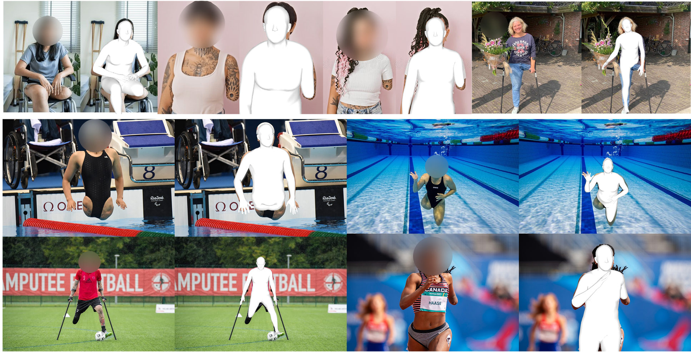
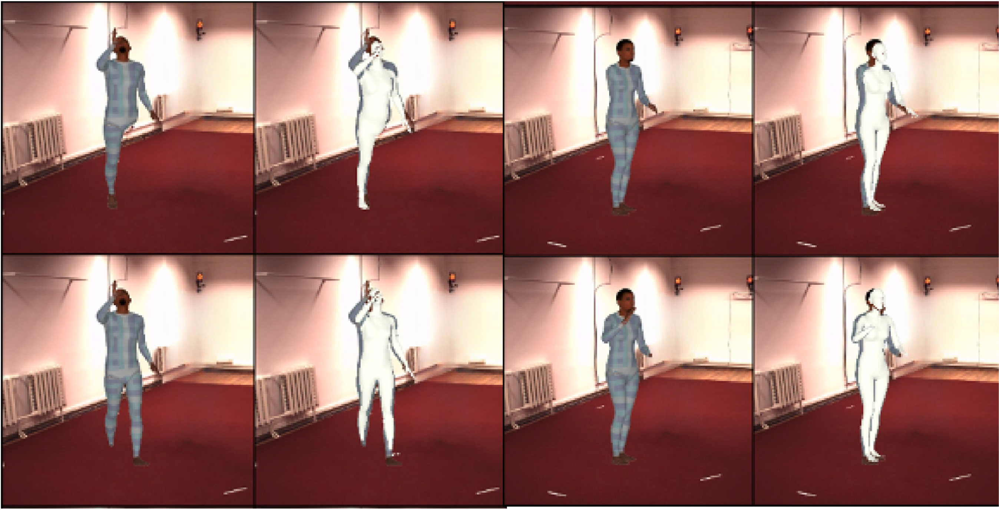
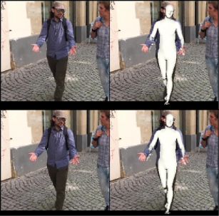

<div align="center">

# AJAHR: Amputated Joint Aware 3D Human Mesh Recovery


### International Conference on Computer Vision (ICCV 2025)

<p>
  <strong><a href="https://chojinie.github.io/categories/">Hyunjin Cho</a><sup>*</sup></strong>, 
  <strong><a href="https://www.linkedin.com/in/%EA%B8%B0%EC%9C%A4-%EC%B5%9C-574114289/?originalSubdomain=kr">Giyun Choi<sup>*</sup></strong>, 
  <a href="https://www.vilab.cau.ac.kr/">Jongwon Choi</a><sup>†</sup>
</p>

<p>
  <sup>*</sup> Equal contribution &nbsp;&nbsp;&nbsp;
  <sup>†</sup> Corresponding author
</p>

[](https://arxiv.org/abs/2509.19939) [](https://chojinie.github.io/project_AJAHR/) 

</div>

---

## Key Idea


Conventional SMPL-based mesh recovery assumes a fully intact human body, causing instability when applied to amputee subjects, as the model attempts to hallucinate non-existent limbs.

To overcome this, we introduce A3D (Amputee 3D Dataset) — a dataset that embeds real amputee configurations, applies joint removal with visibility-aware masking, and defines 12 anatomical amputation regions via AJAHR Index, including all child SMPL joints for each region.

Built with real-world and studio-rendered scenes, A3D includes mesh overlays, ethnicity-aware skin tones, and varied clothing textures, enabling robust amputee-aware mesh regression beyond standard COCO/H36M assumptions.

<details>
  <summary><strong>🔧 Setup and Installation</strong></summary>

  The following section describes the verified environment setup used for reproducing the AJAHR framework.
  All instructions are tested with Python 3.10, PyTorch 2.1.0, and CUDA 11.8.

1. Clone the Repository

Clone the official AJAHR repository to your local or server environment.

```bash
git clone https://github.com/chojinie/AJAHR_official.git
cd AJAHR_official
```

2. Files Required for Inference

To run inference with the AJAHR model, please download the compressed folder from the link below and place it directly inside the AJAHR_official directory without modifying its structure.

🔗 Download link
https://drive.google.com/drive/folders/1YQGWGEEfRgkgZxOtgp1J48j8CNYbM2pl?usp=sharing

After placing the files, the directory structure should look as follows:

```bash
AJAHR_official/
├── ajahr/
├── data/ <<< HERE !
│   ├── body_models/
│   └── checkpoints/
├── vitpose-h-multi-coco.pth
├── demo_out/
├── demo_sample/
├── fig/
├── src/
├── tokenization/
├── ViTPose/
├── data.tar.gz
├── README.md
└── requirements2.txt
```

3. Create a Conda Environment

Create and activate a Conda environment with Python 3.10.
Python versions higher than 3.10 are not supported due to dependency constraints.

```bash
conda create -n ajahr python=3.10
conda activate ajahr
```

4. Install PyTorch (CUDA 11.8)

Install PyTorch with CUDA 11.8 support.
This configuration is fully compatible with Detectron2 and SMPL-based pipelines.

```bash
pip install uv
uv pip install torch==2.1.0 torchvision==0.16.0 torchaudio==2.1.0 \
  --index-url https://download.pytorch.org/whl/cu118
```

5. Install Required Python Dependencies

Install all required Python packages and register ViTPose in PYTHONPATH.

```bash
pip install -r requirements.txt
export PYTHONPATH="/workspace/AJAHR_official/ViTPose:${PYTHONPATH}"
```

6. Install Chumpy and Detectron2

chumpy is required for SMPL model handling, and Detectron2 is used for image-based demos.
Detectron2 is installed from a pinned commit to ensure version compatibility.

```bash
python -m pip install "chumpy==0.70" --no-build-isolation
python -m pip install -U pip setuptools wheel
python -m pip install --no-build-isolation \
  "git+https://github.com/facebookresearch/detectron2.git@fd27788985af0f4ca800bca563acdb700bb890e2"

```

7. Install OSMesa (Headless Rendering Support)

Install system-level dependencies required for mesh rendering in the demo using headless OpenGL.
This step is mandatory when running the demo on Docker or remote server environments without a display server.

```bash
apt update
apt-get install -y llvm-6.0 freeglut3 freeglut3-dev wget
dpkg -i ./mesa_18.3.3-0.deb || true
apt install -f
```

8. Fix OSMesa / PyOpenGL Import Error (If Needed)

If the following command fails and raises the error:

```bash
python -c "from OpenGL.osmesa import OSMesaCreateContextAttribs; print('OSMesaCreateContextAttribs OK')"
ImportError: cannot import name 'OSMesaCreateContextAttribs' from 'OpenGL.osmesa' ...
```

reinstall PyOpenGL and pyrender with compatible versions:

```bash
pip uninstall -y PyOpenGL PyOpenGL_accelerate pyrender
pip install --no-deps --force-reinstall PyOpenGL==3.1.10 PyOpenGL_accelerate==3.1.10
pip install --no-deps pyrender==0.1.45
```

<details>
  <summary><strong><h2>📥 Running AJAHR Demo on Images</strong></h2></summary>
This demo runs AJAHR on a folder of images and produces amputation-aware SMPL mesh reconstructions.

```bash
python ajahr/demo.py \
  --img_folder {DEMO_IMAGE_FOLDER_PATH} \
  --batch_size 1 \
  --full_frame \
  --checkpoint {AJAHR_CHECKPOINT_PATH} \
  --model_config {AJAHR_CONFIG_PATH}
```

Example :

```bash
python ajahr/demo.py \
  --img_folder demo_sample \
  --batch_size=1 \ 
  --full_frame \
  --checkpoint data/checkpoints/ajahr_ckeckpoint.ckpt \
  --model_config data/checkpoints/model_config_inference.yaml
```




<!-- Dataset Preparation -->
<details>
  <summary><strong><h2>📥 Dataset Preparation</strong></h2></summary>
To ensure that the dataset is used <strong>strictly for academic and research purposes</strong>, interested parties are required to complete this request form. Please provide information regarding your <strong>intended use</strong>, <strong>institutional affiliation</strong>, and any <strong>relevant ongoing projects</strong>. Your request will be reviewed, and further instructions will be provided upon approval. 

🔗 <strong>Request Form:</strong> <a href="https://forms.gle/z5QGfXP9PxzSZM9F8" target="_blank" rel="noopener">https://forms.gle/z5QGfXP9PxzSZM9F8</a>
> **Note:** In addition to the assets we release, you can also build your <strong>own amputee-aware dataset</strong> by following the procedure described in our paper. Our pipeline runs an <strong>off-the-shelf human pose/mesh model</strong> on any image that contains a person and uses the predictions as <strong>pseudo ground truth</strong> to construct amputee datasets and labels. We recommend this option when you need domain-specific data (e.g., clinical or in-the-wild). For step-by-step details, please refer to the paper.

### Dataset Structure

The A3D dataset follows a unified directory structure.

```plaintext
A3D_Dataset/
├── COCO_train/
│   ├── Images/
│   └── annotation/
│
├── MPII/
│   ├── Images/
│   └── annotation/
│
├── COCO_val/      ← Evaluation Set
│   ├── Images/
│   └── annotation/ 
│
└── H36M/
    ├── annotation/
    └── Images/
        ├── S1/
        ├── S5/
        ├── S6/
        ├── S7/
        ├── S8/
        ├── S9/
        └── S11/   ← Evaluation Set
```

### Dataset: AJAHR Index & SMPL Mapping


To support amputated-joint–aware mesh reconstruction, we introduce **AJAHR-Index** — a 12-class annotation scheme that partitions **anatomical amputation regions** and aligns them with the SMPL kinematic hierarchy.  
**AJAHR-Index is used at data generation time:** when a region index is set (e.g., “Right Hand”), the pipeline renders the target limb as **amputated** (via visibility-aware masking and mesh overlay), and all labels are produced accordingly. This index is not just a tag; it **controls how images/labels are synthesized** for amputee cases.

```
ajahr_index : {
    0 : Right Hand, 1 : Right Elbow, 2 : Right Shoulder,
    3 : Left Hand, 4 : Left Elbow, 5 : Left Shoulder,
    6 : Left Foot, 7 : Left Knee, 8 : Left Hip,
    9 : Right Foot, 10: Right Knee, 11: Right Hip
}
```
In parallel, each AJAHR region is **mapped to SMPL joint indices** that cover the region and its descendants in the kinematic tree:
```
smpl_index : { 
    21, 23 : Right Hand,      19, 21, 23 : Right Elbow,      17, 19, 21, 23 : Right Shoulder,
    20, 22 : Left Hand,       18, 20, 22: Left Elbow,        16, 18, 20, 22 : Left Shoulder,
    7, 10 : Left Foot,        4, 7, 10 : Left Knee,          1, 4, 7, 10 : Left Hip,
    8, 11 : Right Foot,       5, 8, 11 : Right Knee,         2, 5, 8, 11 : Right Hip
}
```
<!-- > **Note:** `ajahr_index` indicates an amputation region. When an index is marked as amputated, **the corresponding region and all of its descendant joint nodes** are treated as missing. `smpl_index` refers to the **actual SMPL pose joint indices** mapped to each anatomical region. -->
> **How the mapping is used (example).**  
> If `ajahr_index = 0` (**Right Hand**), we treat SMPL joints **21 and 23** (right-hand chain) as **absent** in optimization/inference (e.g., set to **zero pose** / masked from loss and visibility), and we synthesize images to **visually remove** that limb.  
> More generally, when a region is flagged as amputated, **the region and all of its descendant SMPL joints** are excluded from supervision (and optionally zero-posed / masked), ensuring the model does not hallucinate non-existent parts.

For full implementation details (masking, loss masking, supervision rules, and rendering pipeline), **please refer to the paper**.


### Label Extraction Policy (Automatic from `imgname`)
Following the AJAHR framework design, labels are not manually annotated but are implicitly derived from the file naming convention, ensuring scalability and consistency across amputee and non-amputee datasets.

AJAHR does **not** store explicit class labels inside annotation files. Instead, **each sample's amputation level is inferred directly from its `imgname` pattern**, following the logic below:
    
```python
if 'imgname' in self.data:
    self.labels = []
    for file_name in self.imgname:
        amp_number = extract_amp_number(file_name)
        if amp_number is not None:
            self.labels.append(amp_number)
        else:
            self.labels.append(12)
    self.labels = np.array(self.labels)
else:
    #for non-amputee datasets
    self.labels = np.full((self.scale.shape[0],), 12)
```

* `amp_number ∈ {0 ~ 11}` → matches **AJAHR Index** (see mapping above)
* `12` is reserved for the **Non-amputee (default) class**
* Example filename: `amp_3_XXXXXXX.png → label = 3 (Right Elbow)`

---

### Data Shape

**COCO / MPII Based Annotations**

```
center               → shape: (N, 1, 2),  dtype: float64
scale                → shape: (N, 1),     dtype: float64
imgname              → shape: (N,),       dtype: object
global_orient        → shape: (N, 1, 3, 3), dtype: float32
body_pose            → shape: (N, 72),    dtype: float32
has_body_pose        → shape: (N,),       dtype: float32
betas                → shape: (N, 10),    dtype: float32
has_betas            → shape: (N,),       dtype: float32
body_keypoints_2d    → shape: (N, 25, 3), dtype: float64  # indices 0~24 = body
extra_keypoints_2d   → shape: (N, 19, 3), dtype: float64  # indices 25~43 = extra
body_keypoints_3d    → shape: (N, 25, 4), dtype: float64  # indices 0~24 = body
extra_keypoints_3d   → shape: (N, 19, 4), dtype: float64  # indices 25~43 = extra
body_opt_3d_joints   → shape: (N, 25, 1), dtype: float64
extra_opt_3d_joints  → shape: (N, 19, 1), dtype: float64
```

**H36M Based Annotations**

```
imgname     → shape: (N,),             dtype: <U44>
scale       → shape: (N, 1),           dtype: float64
center      → shape: (N, 1, 2),        dtype: float64
ajahr_conf  → shape: (N, 12),          dtype: int64
global_orient → shape: (N, 1, 1, 3, 3), dtype: float64
gt_2d_kpts  → shape: (N, 1, 44, 3),    dtype: float64  # 0~24 body, 25~43 extra
gt_3d_kpts  → shape: (N, 1, 44, 5),    dtype: float64  # 0~24 body, 25~43 extra
smpl_pose   → shape: (N, 1, 23, 3, 3), dtype: float64
smpl_shape  → shape: (N, 1, 10),       dtype: float64
cam_t       → shape: (N, 1, 3),        dtype: float64
```
</details>

## Trained Framework Output Assets

The following examples showcase AJAHR-trained mesh regression results on real amputee scenarios. Leveraging the A3D dataset and the amputation-aware joint representation, the framework successfully reconstructs consistent, anatomically valid SMPL meshes even when major limb regions are missing.

### A3D Evaluation Dataset Evaluation



### 3DPW (Non-amputee) Dataset Evaluation



> These results demonstrate that AJAHR, trained on A3D, leverages BPAC-Net's amputation region classification to avoid hallucinating non-existent limbs, instead generating structurally valid meshes that adapt to the underlying amputee anatomy. Furthermore, this indicates that the proposed framework effectively reduces the representation gap between synthetic A3D training data and real-world amputee imagery.

---

## License
This project is released under a **non-commercial scientific research license**.  
By downloading or using this code and associated data, you agree to the terms specified in the [LICENSE](./LICENSE) file.

Third-party datasets and software are subject to their respective licenses.

## 📚 Citation

If you find **AJAHR** useful in your research, please consider citing:

```bibtex
@inproceedings{ajahr25,
  title     = {AJAHR: Amputated Joint Aware 3D Human Mesh Recovery},
  author    = {Cho, Hyunjin and Choi, Giyun and Choi, Jongwon},
  booktitle = {Proceedings of the IEEE/CVF International Conference on Computer Vision (ICCV)},
  year      = {2025},
  address   = {Honolulu, HI, USA},
  month     = {October},
  publisher = {IEEE},
  note      = {to appear; arXiv:2509.19939}
}

