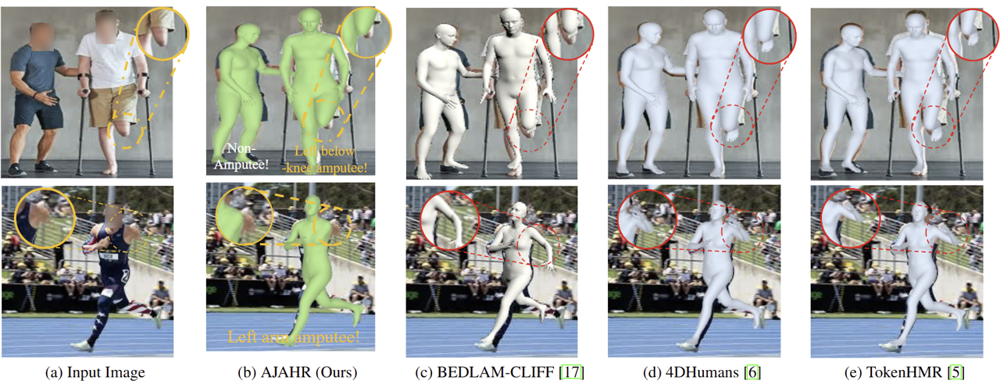

# AJAHR: Amputated Joint Aware 3D Human Mesh Recovery
 
<strong style="font-size: 28px;">International Conference on Computer Vision (ICCV 2025)</strong>
 

  <strong><a href="https://chojinie.github.io/categories/">Hyunjin Cho</a>*</strong>, 
  <strong>Giyun Choi*</strong>, 
  Jongwon Choi†

  * Equal contribution &nbsp;&nbsp;&nbsp;
  † Corresponding author

## 🖼️ Teaser

## Overview
Code repository for the paper: **AJAHR: Amputated Joint Aware 3D Human Mesh Recovery**  
The official Code&Datasets will be released shortly -- Stay tuned!

## Key Idea